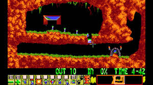
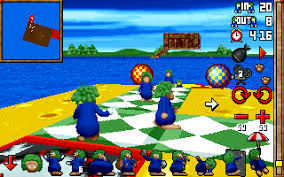
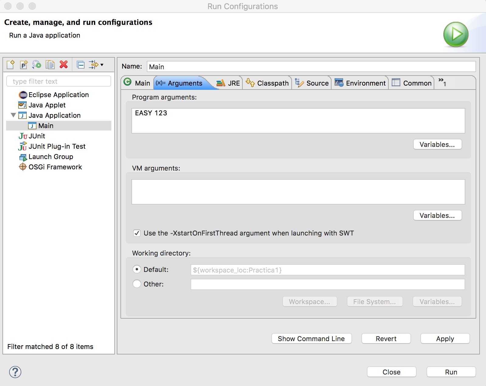
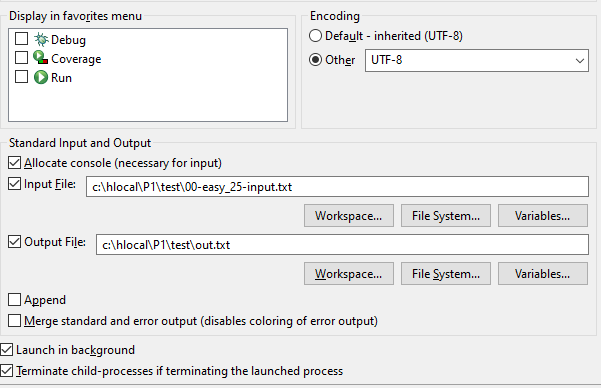
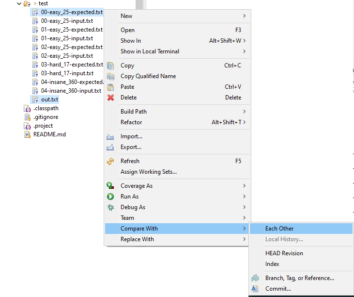

# Práctica 1: Lemmings

**Entrega: Semana del 7 de octubre**
 
**Objetivos:** Iniciación a la orientación a objetos y a Java; uso de arrays y enumerados; manipulación de cadenas con la clase `String`; entrada y salida por consola.

**Preguntas Frecuentes**: Como es habitual (y normal) que tengáis dudas, las iremos recopilando en este [documento de preguntas frecuentes](../faq.md). Para saber los últimos cambios que se han introducido [puedes consultar la historia del documento](https://github.com/informaticaucm-TPI/2425-Lemmings/commits/main/enunciados/faq.md).

<!-- TOC start -->
  * [Control de copias](#control-de-copias)
- [1. Descripción de la práctica](#1-descripción-de-la-práctica)
  * [1.1 Introducción](#11-introducción)
  * [1.2. Detalles sobre la práctica](#12-detalles-sobre-la-práctica)
  * [1.3. Objetos del juego](#13-objetos-del-juego)
- [2. Organización del juego](#2-organización-del-juego)
  * [2.1 Draw](#21-draw)
  * [2.2 User actions](#22-user-actions)
  * [2.3 Updates](#23-updates)
- [3. Implementación ](#3-implementación)
- [4. Entrega de la práctica](#4-entrega-de-la-práctica)
- [5. Pruebas](#5-pruebas)
<!-- TOC end -->

<!-- TOC --><a name="control-de-copias"></a>
## Control de copias

Durante el curso se realizará control de copias de todas las prácticas, comparando las entregas de todos los grupos de TPI. Se considera copia la reproducción total o parcial de código de otros alumnos o cualquier código extraído de Internet o de cualquier otra fuente, salvo aquellas autorizadas explícitamente por el profesor. 

<!-- TOC --><a name="1-descripción-de-la-práctica"></a>
# 1. Descripción de la práctica

<!-- TOC --><a name="11-introducción"></a>
## 1.1 Introducción

Lemmings es un juego clásico, lanzado a comienzos de la década de los noventa, que tuvo una gran influencia en el desarrollo de videojuegos tipo rompecabeza. El juego consiste en guiar a unas criaturas, los lemmings, que caminan automáticamente, a la salida asignándoles distintas tareas, como sacar un paracaídas, cavar o bloquear el camino. Ha habido muchas versiones después de su primer lanzamiento, con entornos 3D



En esta práctica desarrollaremos una versión simplificada del juego clásico, si bien más adelante podremos introducir algunas novedades. En el juego original la acción se desarrolla en tiempo real, es decir, los lemmings se mueven de forma continua, independientemente de las acciones que tome el jugador. Sin embargo, en nuestro caso el juego se desarrollará por turnos, en los que el jugador podrá realizar una acción en cada ciclo del juego, de forma que el juego permanece parado hasta que el jugador indica la acción. Seguidamente, los lemmings se actualizarán para realizar sus movimientos o acciones correspondientes.



Si no has jugado, o no conoces el juego, te recomendamos que lo pruebes antes de desarrollar la práctica. Existen varias versiones gratuitas en la web, una de ellas es accesible a través del enlace: https://www.1001juegos.com/juego/html5-lemmings.

Durante el cuatrimestre vamos a ir desarrollando progresivamente nuestra propia versión del juego. Empezaremos en esta práctica con una versión reducida en la que los lemmings solo caminan automáticamente y ni siquiera tienen que alcanzar ninguna salida. En la práctica 2 incorporaremos más funcionalidad (salidas y las distintas acciones que pueden realizar los lemmings) pero ya haciendo uso de las capacidades que nos da la POO (herencia y poliformismo). 


<!-- TOC --><a name="12-detalles-sobre-la-práctica"></a>
## 1.2. Detalles sobre la práctica

En nuestra primera práctica vamos a considerar que el juego consta de un tablero de **20 x 20** casillas (20 columnas por 20 filas). La versión que implementeís debe depender de constantes de tal forma que el tablero cambie de tamaño con el cambio de estas constantes. La casilla de arriba a la izquierda es la (0, 0) y la de abajo a la derecha la (19, 19). Cada casilla puede estar ocupada por uno o varios lemmings o por una pared/suelo. Las casillas que no estén ocupadas se considerarán casillas vacías. 

Todos los lemmings se mueven automáticamente en la dirección que lleven. Inicialmente se mueven hacia la derecha. Si se topan con una pared invierten su dirección.
Si llegan a un precipicio caen, y solo sobreviven a la caída si no es demasiado grande.

Si todos los lemmings mueren el jugador pierde la partida. En teoría, si llegan a la salida tantos lemmings como requiere el nivel gana el jugador, pero en esta primera versión del juego no existirá esa posibilidad.

Por lo tanto, en esta práctica solo consideraremos un tipo de lemming, el lemming caminante o, como detallaremos más adelante, al lemming cuya acción es siempre la de caminar. 

En cada ciclo del juego se realizan secuencialmente las siguientes acciones:

1. ***Draw.*** Se pinta el tablero y se muestra la información del juego.

2. ***User command.*** El usuario puede actualizar el juego o ejecutar un comando que no actualiza el juego, como solicitar el listado de comandos disponibles o salir del juego.

3. ***Update***. El juego se actualiza, es decir, todos los lemmings del tablero se actualizan.

<!-- TOC --><a name="13-objetos-del-juego"></a>
## 1.3. Objetos del juego

En esta sección describimos el tipo de objetos que aparecen en el juego y su  comportamiento.

### Lemming

Se mueve horizontalmente siguiendo una dirección (izquierda o derecha) o cae si está en el aire.
Al llegar al suelo tras una caída de 3 o más filas muere. Si la caída es inferior sigue caminando en su dirección.


#### Pared/suelo

Es un elemento pasivo en el tablero, de forma que no hace nada al actualizar el tablero.


<!-- TOC --><a name="2-organización-del-juego"></a>
# 2. Organización del juego

A continuación, describimos lo que ocurre en cada parte del bucle del juego.

<!-- TOC --><a name="21-draw"></a>
## 2.1 Draw

En cada ciclo se pintará el estado actual del tablero, así como el número de lemmings que quedan en el tablero, el número de lemmings que aun tienen que llegar a la meta y el ciclo de juego en el que nos encontramos (inicialmente 0).

Cada lemming en el tablero se muestra mediante un símbolo **'B'** si está caminando hacia la derecha o **'ᗺ'** si está caminando a la izquierda (sin comillas). La pared se muestra siempre con el símbolo **'▓'**. También mostraremos el **prompt** del juego para solicitar al usuario la siguiente acción.

El tablero se pintará por el interfaz consola utilizando caracteres ASCII, como muestra el siguiente ejemplo:

```
Number of cycles: 1
Lemmings in board: 2
Remaining lemmings: 2

        0    1    2    3    4    5    6    7    8    9  
     ┌——————————————————————————————————————————————————┐
  0  ┃                                                  ┃  0  
  1  ┃                                                  ┃  1  
  2  ┃                                                  ┃  2  
  3  ┃                 B    B                           ┃  3  
  4  ┃          ▓▓▓▓▓▓▓▓▓▓▓▓▓▓▓                         ┃  4  
  5  ┃                                   ▓▓▓▓▓          ┃  5  
  6  ┃                    ▓▓▓▓▓▓▓▓▓▓▓▓▓▓▓▓▓▓▓▓          ┃  6  
  7  ┃                                                  ┃  7  
  8  ┃                                                  ┃  8  
  9  ┃                                                  ┃  9  
     └——————————————————————————————————————————————————┘
        0    1    2    3    4    5    6    7    8    9  

Command > 
```


<!-- TOC --><a name="22-user-actions"></a>
## 2.2 User actions

Se preguntará al usuario qué quiere hacer, a lo que podrá contestar una de las siguientes alternativas:


- `help`: Este comando solicita a la aplicación que muestre la ayuda relativa a cómo utilizar los comandos. Se mostrará una línea por cada comando. Cada línea tiene el nombre del comando seguida por ':' y una breve descripción de lo que hace el comando. 

```
Command > help

Available commands:
[r]eset: start a new game
[h]elp: print this help message
[e]xit: end the execution of the game
[n]one | "": skips cycle
```

- `reset`: Este comando permite reiniciar la partida, llevando al juego a la configuración inicial.

- `exit`: Este comando permite salir de la aplicación, mostrando previamente el mensaje *Player leaves game*.

- `none`: El usuario no realiza ninguna acción, se actualiza el juego.

**Observaciones sobre los comandos:**

- La aplicación debe permitir comandos escritos en minúsculas, mayúsculas o mezcla de ambas.
 
- La aplicación debe permitir el uso de la primera letra del comando (o la indicada entre corchetes, si esa letra ya se utiliza) en lugar del comando completo `[R]eset`, `[H]elp`, `[E]xit`, `[N]one`.
  
- Si el comando es vacío se identifica como `none` y se avanza al siguiente ciclo de juego.
 
- Si el comando está mal escrito, no existe, o no se puede ejecutar, la aplicación mostrará un mensaje de error.

- En el caso de que el usuario ejecute un comando que no cambia el estado del juego, o un comando erróneo, el tablero no se debe repintar. 


<!-- TOC --><a name="23-updates"></a>
## 2.3 Update

En cada ciclo se produce la actualización de cada lemming, que da lugar a sus movimientos (y más adelante posiblemente a otras acciones).  
El juego finalizará si durante la acción **Update** mueren
todos los lemmings.

Cuando el juego termine se debe mostrar el mensaje: **'Player looses'**.


### Colocación inicial de los lemmings

En esta primera versión de la práctica el juego se inicializará de manera ***ad-hoc***, colocando lemmings y paredes en distintas posiciones en métodos dedicados a ello.


### Parámetros de la aplicación

NO HACE FALTA, NO? A NO SER QUE EL NIVEL DETERMINE CUÁNTOS LEMMINGS HAY QUE SALVAR O ALGO ASÍ
<span style="color:orange">**AE**: Lo del nivel molaría y ya desde ahora se podrían poner dos escenarios cargados ***ad-hoc*** si os parece. Pero no me importa que no se incluya, ya que puede simplificar.</span>

<!---

El programa debe aceptar un parámetro obligatorio y uno opcional por línea de comandos.

  -  El primero, llamado **level**, es el nivel de juego y es obligatorio.

  -  El segundo, llamado  **seed**, contiene el valor de la semilla usada para el comportamiento pseudoaleatorio del juego y es opcional. 



-->

<!-- TOC --><a name="3-detalles-de-implementación"></a>
# 3. Implementación

La implementación propuesta para la primera práctica no es la mejor, ya que no hace uso de **herencia** y **polimorfismo**, dos herramientas básicas de la programación orientada a objetos. Más adelante, veremos formas de mejorarla mediante el uso de las herramientas que nos brinda la programación orientada a objetos. 

Para implementar la primera versión tendremos que copiar y pegar mucho código y esto casi siempre es una mala práctica de programación. La duplicación de código implica que va a ser poco mantenible y *testeable*. Hay un principio de programación muy conocido llamado **DRY (Don't Repeat Yourself)** (**No te repitas**, en castellano). Según este principio, ninguna información debería estar duplicada, ya que la duplicación incrementa la dificultad de los cambios y evolución posterior, puede perjudicar la claridad y dar pie a posibles inconsistencias.

En la siguiente práctica veremos cómo refactorizar el código para evitar repeticiones.

Para lanzar la aplicación se ejecutará la clase `tp1.Main`,
por lo que se aconseja que todas las clases desarrolladas en la práctica estén en el paquete `tp1` (o subpaquetes suyos). 

### Objetos del juego

Para representar cada uno de los tipos de elementos que pueden aparecer en el tablero, a los que llamaremos objetos del juego, necesitarás, al menos, las siguientes clases:

- `Lemming`: clase que representa a un lemming. Tiene como atributos su posición `(columna, fila)`, un booleano que indica si está vivo o no, la dirección de su movimiento, el número de turnos que lleva cayendo, ... Además, los lemming tienen un atributo de tipo `WalkerAction` y otro de tipo `Game` que explicamos a continuación.

El atributo de tipo `WalkerAction` representa el comportamiento del lemming como de tipo ***caminante***. El lemming delega muchas de sus tareas en este atributo. Esto nos permitirá en la práctica 2 cambiar la accion del lemming por otra distinta (y por lo tanto su comportamiento y cómo se muestra en el tablero) en tiempo de ejecución. 

El atributo de tipo `Game` (ver más adelante) permitirá al lemming interactuar con su entorno para, por ejemplo, saber si la posición a la que se pretende mover está ocupada. Esto tiene la desventaja de que, en principio, un lemming tiene acceso a todos los métodos públicos de `Game`, no solo aquellos pensados para la interacción del lemming con su entorno. Esto lo resolveremos en la práctica 2 mediante el uso de ***interfaces***.

- `Wall`: clase que representa la pared o el suelo en el tablero y que en esta versión de la práctica va a tener poca o ninguna funcionalidad. Tiene un atributo para su posición. Como no interactúa con su entorno no necesita el atributo de tipo `Game`.


### Update

Todos los objetos del juego implementarán un método

```java
    public void update() {...}
```
en el que se implementará la actualización del objeto en función de su estado y del estado del juego. Esa actualización puede, por lo tanto, modificar el estado del objeto pero también el de su entorno, gracias 
a la referencia `game` que hemos dicho que íbamos a mantener
(lo que ocurrirá en la práctica 2).

La actualización de una pared/suelo es trivial (no hacer nada). Los lemmings, sin embargo, deberán:

- Comprobar que están vivos
- Si no están cayendo delegar en la acción.
- Si están cayendo gestionar la caída. En particular, morir si alcanzan el suelo tras una caída demasiado grande.

Para saber si están cayendo o si mueren en una caída también es necesario delegar en su acción. Ten en cuenta que más adelante se pueden dar situaciones en las que estar en el aire no implique caer (escalador) o caer demasiado no implica morir (paracaídas).


#### Eliminación de objetos del juego

Los objetos de juego incluirán un método

```java
    public void onDelete() {...}
```

que será invocado **desde el contenedor de objetos** cuando se detecte que el objeto ha muerto, justo antes de que el objeto sea eliminado definitivamente de su contenedor (ver más abajo). 

Dicho método se encargará de realizar aquellas acciones necesarias en el momento de la eliminación del objeto. Por ejemplo, los lemmings notificarán al juego que han muerto para que éste lleve la cuenta del número de lemmings vivos.

### Contenedor de objetos de juego 

En el tablero puede haber múltiples lemmings y múltiples suelos/paredes. Por ello, necesitamos clases que representen *contenedores* de estos objetos del juego.

Una posibilidad es tener una clase `GameObjectContainer` que contenga ***arrays*** (incompletos, es decir, suficientemente grandes y junto con un contador), uno para los lemmings y otro para las paredes.

<span style="color:orange">**AE**: Si os parece, podríamos pedirles que usen los ArrayList y así que utilicen algo de las colecciones de Java desde el principio y que empiecen a leer la documentación de las librerías de Java.</span>

Esta clase tendrá también métodos para su gestión. En particular, tendrá métodos

```java
    public void add(Lemming lemming) {...}
```

y

```java
    public void add(Wall wall) {...}
```

Fíjate que esos métodos están sobrecargados, es decir, se llaman igual pero el compilador los distingue por el tipo de su parámetro.

Además, el contenedor será responsable de llevar las peticiones del juego a cada uno de sus objetos.


### El modelo: la clase `Game`

La clase `Game` encapsula la lógica del juego. Habrá una única instancia de `Game` en el programa. Contiene una instancia de `GameObjectContainer`, entre otras instancias de objetos. También tiene mantiene el contador de turnos, el número de lemmings en el tablero, ... 

 Tiene, entre otros, el método `update` que actualiza el estado de todos los elementos del juego. Su implementación consistirá esencialmente en incrementar el turno del juego
 y en invocar al método `update` del `GameObjectContainer` que a su vez invorá al método `update` de cada uno de los objetos del juego.

### Clases para el control y la visualización

- `Controller`: clase para controlar la ejecución del juego, preguntando al usuario qué quiere hacer y actualizando la partida de acuerdo a lo que éste indique. La clase `Controller` necesita, al menos, tres atributos privados:

```java
  private Game game;
  private Scanner in;
  private GamePrinter printer;
```

El objeto `in` sirve para leer de la consola las órdenes del usuario.

La clase `Controller` implementa el método público `public void run()` que controla el bucle principal del juego. Concretamente, mientras la partida
no esté finalizada, solicita órdenes al usuario y las ejecuta.

- `GamePrinter`: recibe el `game` y tiene un método `toString` que sirve para pintar el juego como veíamos anteriormente. 

### Otras clases

- `Direction`: enumerado para representar los distintos movimientos que pueden hacer los objetos del juego.

- `Position`: clase inmutable para representar una posición del tablero, es decir, para encapsular una columna y una fila.

- `Main`: Es la clase que contiene el método `main` de
la aplicación. En este caso, el método `main` crea una nueva partida (objeto de la clase `Game`), crea una vista objeto de la clase `GamePrinter`), crea un controlador (objeto de la clase `Controller`) con dicha partida, e invoca al método `run` del controlador.

<span style="color:orange">**AE**: Creo que el `GamePrinter` debería tener un método print(Game) y no ser simplemente un conversor del Game a String y quitar del `Main` y del `Controller` los System.out. Para hacer un patrón `MVC` algo mejor. Si os parece lo cambio.</span>

### Observaciones a la implementación

Durante la ejecución de la aplicación solo se creará un objeto de la clase `Controller`. Lo mismo ocurre para la clase `Game`, que representa la partida en curso y solo puede haber una activa.

Junto con la práctica, os proporcionaremos unas plantillas con partes del código.

El resto de información concreta para implementar la práctica será explicada por el profesor durante las distintas clases de teoría y laboratorio. En esas clases se indicará qué aspectos de la implementación se consideran obligatorios para poder aceptar la práctica como correcta y qué aspectos se dejan a la voluntad de los alumnos.


<!-- TOC --><a name="4-entrega-de-la-práctica"></a>
# 4. Entrega de la práctica

La práctica debe entregarse utilizando el mecanismo de entregas del campus virtual, no más tarde de la **fecha y hora indicada en la tarea del campus virtual**.

El fichero debe tener, al menos, el siguiente contenido [^1]:

- Directorio `src` con el código de todas las clases de la práctica.
- Fichero `alumnos.txt` donde se indicará el nombre de los componentes del grupo.

Recuerda que no se deben incluir los `.class`.

> **Nota**: Recuerda que puedes utilizar la opción `File > Export` para ayudarte a generar el .zip.

[^1]: Puedes incluir también opcionalmente los ficheros de información del proyecto de Eclipse

<!-- TOC --><a name="5-pruebas"></a>
# 5. Pruebas

Junto con las instrucciones de la práctica, tendrás una carpeta con trazas del programa. Encontrarás varios ficheros con la siguiente nomenclatura:

- `00-easy_25-input.txt`: es la entrada del caso de prueba `0` con nivel `easy` y semilla `25`.
- `00-easy_25-expected.txt`: es la salida esperada para la entrada anterior.
- `00-hard_25-input.txt`: es la entrada del caso de prueba `0` con nivel `hard` y semilla `25`.
- `00-hard_25-expected.txt`: es la salida esperada para la entrada anterior.
- `00-insane_25-input.txt`: es la entrada del caso de prueba `0` con nivel `insane` y semilla `25`.
- `00-insane_25-expected.txt`: es la salida esperada para la entrada anterior.
- `01-insane_25-input.txt`: es la entrada del caso de prueba `1` con nivel `insane` y semilla `25`.
- `01-insane_25-expected.txt`: es la salida esperada para la entrada anterior.

En Eclipse, para usar un fichero de entrada y volcar la salida en un fichero de salida, debes configurar la redirección en la pestaña `Common` de la ventana `Run Configurations`, tal y como se muestra en la siguiente figura. Lo más cómodo es crear, al menos, una `Run Configuration` para cada caso de prueba.



Hay multitud de programas gratuitos para comparar visualmente ficheros, por ejemplo Eclipse ya tiene integrada una herramienta para comparar archivos que puedes lanzar al seleccionar dos archivos, pulsar con el botón derecho y en el menú emergente seleccionar `Compare With > Each other`.



Aparecerá una nueva ventana donde se mostrarán marcadas claramente las diferencias entre los archivos.

Por supuesto, nuestra salida puede tener algún error, así que si detectas alguna inconsistencia por favor comunícanoslo para que lo corrijamos.

Durante la corrección de prácticas <!-- os daremos nuevos --> usaremos otros ficheros de prueba para asegurarnos de que vuestras prácticas se generalizan correctamente, así que asegúrate de probar no solo los casos que te damos, sino también otras posibles ejecuciones.
